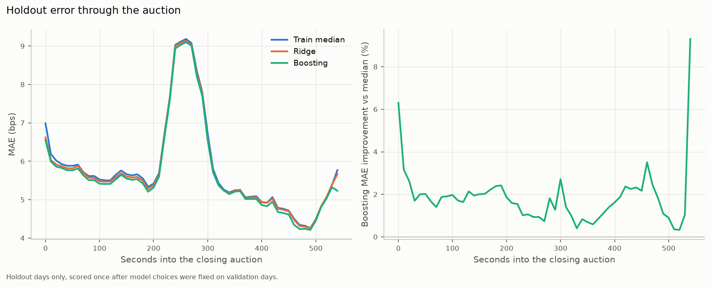

# Closing-Auction Return Prediction (Optiver Kaggle Dataset)

Predicting each Nasdaq stock's 60-second return relative to a synthetic index during the closing auction, from 5.2 million order-book and auction snapshots. Uses the archived Kaggle dataset [Optiver – Trading at the Close](https://www.kaggle.com/competitions/optiver-trading-at-the-close) (2023). An independent research exercise, not a competition entry, and not affiliated with Optiver.

## Results

Scored once on a final holdout of the last 60 trading days, after every model choice had been made on earlier validation days.

| Model | Holdout MAE (bps) | vs baseline |
|---|---:|---:|
| Training median (baseline) | 5.815 | — |
| Ridge regression | 5.768 | −0.8% |
| **Gradient boosting** | **5.708** | **−1.8%** |

- **Small but consistent:** boosting beat the baseline on all 60 holdout days (mean daily gain 0.107 bps, standard error 0.004) and for 184 of 200 stocks.
- **Target definition verified against the data:** subtracting the target from each stock's own 60-second return leaves an index return shared by every stock at that moment. It varies by 0.005 bps across stocks, compared with 8.4 bps for the returns themselves.
- **Error depends on the auction phase:** it nearly doubles for predictions made at 230–290 s, whose 60-second window crosses the 300 s mark when near/far indicative prices start being published.
- **Most-used features:** time in the auction, WAP vs mid, the stock's WAP vs its auction reference price relative to other stocks, and auction imbalance.



Full write-up: [reports/REPORT.md](reports/REPORT.md). Data audit: [reports/data_audit.md](reports/data_audit.md).

## How it works

1. **Data audit.** Keys, chronology, missingness by column and by second, price normalization, and an empirical check of the target definition.
2. **Split by whole days, in time order.** Train days 0–360, validation 361–420, holdout 421–480. All stocks on a given day share a set, so every score is on unseen future days.
3. **Leakage-safe features.** 19 interpretable features: spreads, book and auction imbalances, far/near vs reference price, recent returns within the same stock and day, and each stock relative to the others at the same second. Tests confirm that changing data after time t never changes a feature at t.
4. **Models.** Zero and median baselines, ridge (winsorizing, imputation and scaling all fit on training rows only) and gradient boosting with absolute-error loss. A small grid, chosen on validation, then refit on train + validation and scored once on the holdout.
5. **Error analysis** by second in the auction, by day and by stock, plus permutation importance.

## Limitations

- A forecasting result, not a trading strategy: no execution, costs or capacity are modelled.
- Small feature set and modest tuning; one chronological split and one 60-day holdout period.
- An equal-weighted cross-stock average stands in for the index; the index weights aren't used.

## Reproduce

Requires [uv](https://docs.astral.sh/uv/) and a Kaggle account that has accepted the competition rules.

```bash
uv sync
uv run kaggle competitions download -c optiver-trading-at-the-close -p data/raw
(cd data/raw && unzip -q optiver-trading-at-the-close.zip)
uv run pytest                              # synthetic-data checks
uv run python scripts/audit_data.py        # audit + parquet cache
uv run python scripts/train_evaluate.py    # model comparison, a few minutes
```

## Layout

```
src/closing_auction/  data (load + audit + target check), split, features, models, plotting
scripts/              audit_data, train_evaluate
tests/                synthetic-data checks: split, no lookahead, zero denominators, target check
reports/              REPORT.md, data_audit.md, results.md/json, figures
```

## Data

Competition data is subject to Kaggle's competition rules and is not included in this repository.
